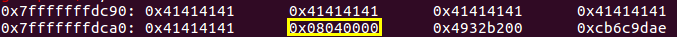

# 指针解疑
### 序言
> &nbsp;&nbsp;&nbsp;&nbsp;近日学习`Linux`内核漏洞, 发现写出的`exp`令我叹服．不禁感叹`writer`对`C`语言了解之深.下面是我对指针的一些总结, 仰慕大佬.

### 1. (void **)
*解析:* 指针的指针
```c
#include <stdio.h>
#include <stdlib.h>
#include <string.h>

int main(void){
    char buf[24] = {0};
    memset(buf, 'A', 24);
  *((void **)(buf+20)) = 0x08040000;
/*
 * 将 buf的最后四个字节的内容赋值为0x08040000
 * *(int *)(buf+20) = 0x08040000; 同样可以达到相同的效果.
 */

    return 0;
}
```
结果图:


### 2. [modify calling convention](https://en.wikipedia.org/wiki/Calling_convention#x86)
*解析*: `x86`下, 程序默认是通过将参数压入栈中的方式传递参数. 内核中的函数是通过`eax, edx, ecx`寄存器传递, 再多的参数也是通过栈来传递.
```c
#include <stdio.h>
#include <stdlib.h>

#define REGPARM0 __attribute__((regparm(0))) //不使用寄存器
#define REGPARM3 __attribute__((regparm(3))) //使用eax, ecx, edx

int q = 5;

void REGPARM0 p1(int a){
    q = a + 1;
}
void REGPARM3 p2(int a, int b, int c, int d){
    q = a + b + c + d;
}

int main(void){
    int t1 = 1;
    int t2 = 2;
    int t3 = 3;
    int t4 = 4;
    p1(t1);
    p2(t1, t2, t3, t4);
    return 0;
}
```
`p2`函数参数传递对应的汇编代码:
```
0x8048416 <main+46>:	mov    ecx,DWORD PTR [ebp-0xc]
0x8048419 <main+49>:	mov    edx,DWORD PTR [ebp-0x10]
0x804841c <main+52>:	mov    eax,DWORD PTR [ebp-0x14]
0x804841f <main+55>:	mov    ebx,DWORD PTR [ebp-0x8]
0x8048422 <main+58>:	mov    DWORD PTR [esp],ebx
0x8048425 <main+61>:	call   0x80483c4 <p2>
```
*参考链接*
[__attribute__((regparm(n)))](https://blog.csdn.net/cosmoslife/article/details/48680989)
### 3. 函数指针
*函数指针*: 一个指针, 指向的内容是一个函数.
*指针函数*: 一个函数, 返回一个指针.
```c
#include <stdio.h>

#define KERNCALL __attribute__((regparm(3)))
typedef void (*fun)(void* );

void f(void* s){
    printf("Welcome, %s\n", (char *)s);
}

int main(){
    void* (*h)(void*) = (void *)&f; //h is a function pointer
    /*
     * void* (*h)(void*) KERNCALL = (void *)&f;
     * 同时改变calling convention
     */
    h("bill");
    return 0;
}
```
*参考链接*
[typedef函数指针用法](https://blog.csdn.net/qll125596718/article/details/6891881)

# 4. __attribute__ gcc
*解析*: 针对`GCC`编译进行优化的选项, 内容很多, 请自行查阅.
[Attribute Syntax](https://gcc.gnu.org/onlinedocs/gcc/Attribute-Syntax.html)
