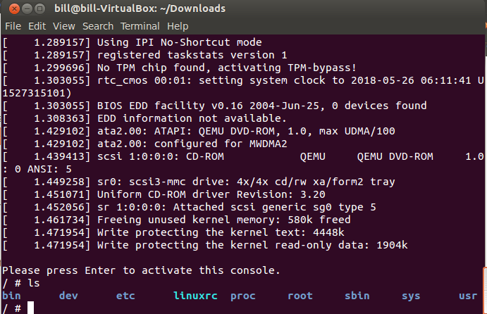

# 新手玩转`Linux Kernel`漏洞`Null Pointer Dereference`之环境搭建

### 条件
```
System: Ubuntu 12.04 i386(虚拟机即可)
Disk Space: 50G(编译内核很耗资源)
BusyBox: 1.19.4(将常见的Unix 命令集成在了一个可执行文件)
Qemu(一个模拟器, 非常强悍)
Source Code: Linux Kernel 2.6.32
```
[Linux Kernel 2.6.32下载链接](https://mirrors.edge.kernel.org/pub/linux/kernel/v2.6/linux-2.6.32.tar.gz)
[BusyBox 1.19.4 下载链接](https://busybox.net/downloads/busybox-1.19.4.tar.bz2)
### 编译工具
```bash
sudo apt-get install build-essential libncurses5-dev
sudo apt-get install qemu qemu-system
```
### 编译内核
```bash
make menuconfig
make
make modules
make modules_install(可选)
```
### 编译`BusyBox`
```bash
# BusyBox Settings --> Build Options --> Build BusyBox as a static ....
# 取消Linux System Utilities -->  Support mounting NFS file system
# 取消Networking Utilities --> inetd
$ make menuconfig
$ make
$ make install #在busybox源码目录中生一个一个_install的目录
$ cd _install
$ mkdir proc sys dev etc etc/init.d
$ vim etc/init.d/rcS
#!/bin/sh
mount -t proc none /proc #挂在proc虚拟文件系统
mount -t sysfs none /sys　#挂在sysfs虚拟文件系统
/sbin/mdev -s
$ chmod +x etc/init.d/rcS
$ find . | cpio -o -H newc > ../rootfs.img #生成一个rootfs,这个文件系统很关键
```
### 常见问题
> 1. ` error: duplicate member ‘page’`
> > 将第`128`行代码注释掉
> 2. `elf_i386: No such file or directory`
> >  ```
> >  28 - VDSO_LDFLAGS_vdso.lds = -m elf_x86_64 -Wl,-soname=linux-vdso.so.1
> >  28 + VDSO_LDFLAGS_vdso.lds = -m64 -Wl,-soname=linux-vdso.so.1
> > 72 - 2 VDSO_LDFLAGS_vdso32.lds = -m elf_i386 -Wl,-soname=linux-gate.so.1
> > 72 + 2 VDSO_LDFLAGS_vdso32.lds = -m32 -Wl,-soname=linux-gate.so.1
> >  ```
### 结果
将下面保存为`./boot.sh`
```bash
#!/bin/sh
qemu-system-i386 -m 128M -kernel linux-2.6.32/arch/x86/boot/bzImage -initrd busybox-1.19.4/rootfs.img -append "console=ttyS0 root=/dev/ram rdinit=/sbin/init" --nographic
```
启动`./boot.sh`


### 忠告
> &nbsp;&nbsp;&nbsp;&nbsp;我曾经尝试通过在`Linux Kernel 2.6.32`内核源码中打`KGDB`调试的补丁, 但是`Google`了好久, 没找到对应的文件. 搜索到的结果中, 关于`KGDB`补丁的链接均失效了。所以奉劝大家, 实在不行就找内核源码已打好`KGDB`补丁的源码, 这里给大家一个版本`Linux Kernel 3.10`

### 参考链接
[pwn4](http://pwn4.fun/2017/04/17/Linux%E5%86%85%E6%A0%B8%E6%BC%8F%E6%B4%9E%E5%88%A9%E7%94%A8%EF%BC%88%E4%B8%80%EF%BC%89%E7%8E%AF%E5%A2%83%E9%85%8D%E7%BD%AE/)
